# FinEleMethod Architecture

This document describes the architecture currently implemented in FinEleMethod.
The command-line solver is independently runnable. The implemented wxWidgets
Windows workbench launches it as a separate analysis process rather than running
the FEM solution on the user-interface thread. The GUI links the core library
for model inspection, project storage, and protocol validation.

## Design goals

- Keep finite element formulations independent from input, output, and user
  interfaces.
- Build and verify each numerical operation separately.
- Preserve the analysis pipeline from element matrices through sparse solution.
- Make solver results consumable by both people and future applications.
- Keep the code organized so additional elements and analysis types can be added
  without rewriting existing formulations.

## Component architecture

```mermaid
flowchart LR
    User[User] --> GUI[Windows workbench]
    User --> CLI[Command-line application]
    GUI --> Project[Project and immutable run storage]
    Project --> Request[analysis-request.json]
    GUI -->|Launch separate process| CLI
    Request --> CLI
    CLI -->|JSON Lines progress| GUI
    CLI --> Input[ABAQUS input layer]
    Input --> Model[Validated model objects]
    Model --> Solver[Analysis orchestration]

    Solver --> Elements[Q4 and H8 formulations]
    Solver --> Assembly[COO assembly]
    Assembly --> Constraints[Direct displacement elimination]
    Constraints --> CSR[CSR sparse system]
    CSR --> LinearSolver[Conjugate Gradient solver]
    LinearSolver --> Recovery[Reaction and result recovery]

    Recovery --> VTK[VTU result writer]
    Recovery --> Summary[Versioned JSON summary]
    VTK --> ParaView[ParaView]
    Summary --> GUI
    GUI -->|Open result through Windows association| ParaView
```



## Source-code layers

| Layer | Responsibility | Main directories |
| --- | --- | --- |
| Application | Starts the program and maps process arguments to stable exit codes | `apps/cli`, `src/cli`, `src/core` |
| Workbench | Owns Windows controls, launches and monitors the solver, and displays run history | `apps/gui` |
| Project storage | Validates project JSON, saves metadata, prepares run snapshots, and records lifecycle state | `src/project` |
| Input | Reads ABAQUS text and constructs validated Q4 or H8 models | `src/input` |
| Model | Stores nodes, elements, materials, loads, and degree-of-freedom mappings | `src/model` |
| Mechanics | Creates isotropic elastic constitutive matrices and stress measures | `src/mechanics` |
| Elements | Implements Q4 and H8 interpolation, Jacobians, stiffness, pressure, and recovery | `src/elements` |
| Assembly | Maps element contributions and loads into the global sparse system | `src/assembly` |
| Solver | Applies constraints, solves the linear system, and recovers reactions | `src/solver` |
| Post-processing | Produces strains, stresses, von Mises values, and principal stresses | `src/postprocessing` |
| Output | Writes ParaView VTU results and versioned JSON analysis summaries | `src/output` |

Public declarations are stored under the matching folders in
`include/finelemethod`. Tests mirror these layers under `tests`.

## Analysis workflow


## Numerical data flow

For each element, FinEleMethod evaluates its stiffness matrix independently.
The element degree-of-freedom mapping determines where every matrix entry is
added to the global COO matrix. Duplicate COO coordinates are combined during
conversion to CSR. Prescribed displacements are applied by direct elimination,
and the resulting symmetric system is solved with the custom Conjugate Gradient
implementation.

```text
element coordinates + material + section
                    |
                    v
         element stiffness matrix
                    |
                    v
     element-to-global DOF mapping
                    |
                    v
          COO global assembly
                    |
                    v
 direct elimination of prescribed DOFs
                    |
                    v
          CSR matrix + load vector
                    |
                    v
       Conjugate Gradient solution
                    |
                    v
 displacements + reactions + recovered fields
```

## Supported analysis paths

The input element type selects the analysis path automatically:

| ABAQUS type | FinEleMethod formulation | Spatial degrees of freedom per node |
| --- | --- | ---: |
| `CPS4` | Q4 plane stress | 2 |
| `CPE4` | Q4 plane strain | 2 |
| `C3D8` | H8 three-dimensional solid | 3 |

All three paths share the sparse assembly, constraint, linear-solution, reaction,
and output concepts. Their element formulation and result-recovery code remains
separate so each formulation can be tested independently.

The mathematical details are documented in the [Q4 formulation](formulations/Q4.md)
and [H8 formulation](formulations/H8.md). Their shared assembly, constraint,
iterative solution, and reaction-recovery process is documented in
[Global System and Sparse Solution](formulations/SYSTEM_SOLUTION.md).

## Error boundary

The command-line layer translates failures into the stable exit codes recorded
in [PROJECT_DECISIONS.md](PROJECT_DECISIONS.md). Parsing, model validation,
numerical solution, and result-writing errors remain distinguishable. The GUI
combines process exit codes, validated progress, standard error, and completion
files when reporting the outcome. Exit code zero alone is not sufficient to
accept a completed analysis.

## Implemented GUI boundary

`MainFrame` prepares a numbered run and starts the adjacent `FinEleMethod.exe`
with `--request`. A wxWidgets timer drains redirected standard output and standard
error while the GUI remains responsive. JSON Lines progress is parsed separately
from human-readable error messages. A process-completion event triggers summary
validation and restores the controls for another analysis.

Only one analysis runs at a time. Cancellation writes a run-local flag; the solver
checks it cooperatively. A cancellation is accepted when the exit code and valid
progress agree. Closing normally is blocked while a solver process is active.

The GUI checks summary paths against the active run and requires the result file
to exist before enabling **Open Result**. It uses the Windows file association
to open the VTU file; it does not embed ParaView or a VTK renderer.

## Project and recovery lifecycle

The main JSON stores project identity and a relative input path. The project
layer validates the model location and `runs/` directory on disk. Each new run
contains its own input snapshot, request, lifecycle state, and results paths.
Run history is rediscovered from disk rather than stored in a database.

Project saves are atomic and retain one backup. Explicit recovery snapshots are
separate `.autosave.json` files containing metadata, not copies of model data or
results. A recovered project is marked unsaved until the main JSON is saved.
Normal close and project-switch operations request confirmation before leaving
this state; declining preserves the current project. A successful save clears
the marker even when snapshot cleanup reports a warning. A failed save does not.

History labels use persisted lifecycle state where available. A `completed`
state must also pass the project layer's completion checks. Missing or invalid
state falls back to `completed` or `not completed` based on those checks; it
does not establish that an old `executing` run still has a live process.

## Verification boundary

Unit and integration tests cover the numerical and file/protocol layers.
Packaging checks validate DLL staging and workbench startup. Neither proves that
all interactive GUI paths work. Use the [GUI acceptance checklist](GUI_ACCEPTANCE.md)
to record interactive checks and outstanding release work separately.
