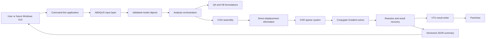
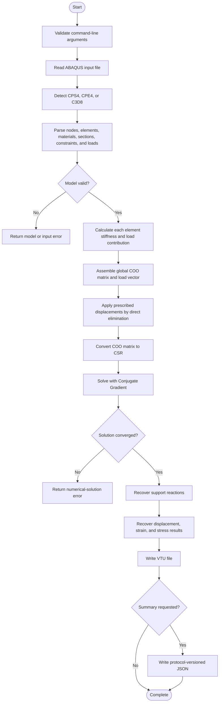

# FinEleMethod Architecture

This document describes the architecture currently implemented in FinEleMethod.
The command-line solver is the first product interface. The future Windows GUI
will use the command-line application as a separate analysis process rather than
embedding FEM calculations in the user-interface code.

## Design goals

- Keep finite element formulations independent from input, output, and user
  interfaces.
- Build and verify each numerical operation separately.
- Preserve the analysis pipeline from element matrices through sparse solution.
- Make solver results consumable by both people and future applications.
- Keep the code organized so additional elements and analysis types can be added
  without rewriting existing formulations.

## Component architecture



## Source-code layers

| Layer | Responsibility | Main directories |
| --- | --- | --- |
| Application | Starts the program and maps process arguments to stable exit codes | `apps/cli`, `src/cli`, `src/core` |
| Input | Reads ABAQUS text and constructs validated Q4 or H8 models | `src/input` |
| Model | Stores nodes, elements, materials, loads, and degree-of-freedom mappings | `src/model` |
| Mechanics | Creates isotropic elastic constitutive matrices and stress measures | `src/mechanics` |
| Elements | Implements Q4 and H8 interpolation, Jacobians, stiffness, pressure, and recovery | `src/elements` |
| Assembly | Maps element contributions and loads into the global sparse system | `src/assembly` |
| Solver | Applies constraints, solves the linear system, and recovers reactions | `src/solver` |
| Post-processing | Produces strains, stresses, von Mises values, and principal stresses | `src/postprocessing` |
| Output | Writes ParaView VTU results and versioned JSON analysis summaries | `src/output` |

Public declarations are stored under the matching folders in
`include/finelemethod`. Tests mirror these layers under `tests`.

## Analysis workflow



## Numerical data flow

For each element, FinEleMethod evaluates its stiffness matrix independently.
The element degree-of-freedom mapping determines where every matrix entry is
added to the global COO matrix. Duplicate COO coordinates are combined during
conversion to CSR. Prescribed displacements are applied by direct elimination,
and the resulting symmetric system is solved with the custom Conjugate Gradient
implementation.

```text
element coordinates + material + section
                    |
                    v
         element stiffness matrix
                    |
                    v
     element-to-global DOF mapping
                    |
                    v
          COO global assembly
                    |
                    v
 direct elimination of prescribed DOFs
                    |
                    v
          CSR matrix + load vector
                    |
                    v
       Conjugate Gradient solution
                    |
                    v
 displacements + reactions + recovered fields
```

## Supported analysis paths

The input element type selects the analysis path automatically:

| ABAQUS type | FinEleMethod formulation | Spatial degrees of freedom per node |
| --- | --- | ---: |
| `CPS4` | Q4 plane stress | 2 |
| `CPE4` | Q4 plane strain | 2 |
| `C3D8` | H8 three-dimensional solid | 3 |

All three paths share the sparse assembly, constraint, linear-solution, reaction,
and output concepts. Their element formulation and result-recovery code remains
separate so each formulation can be tested independently.

## Error boundary

The command-line layer translates failures into the stable exit codes recorded
in [PROJECT_DECISIONS.md](PROJECT_DECISIONS.md). Parsing, model validation,
numerical solution, and result-writing errors remain distinguishable so a future
GUI can show an accurate failure reason.

## Future GUI boundary

The planned wxWidgets application will prepare an analysis request and start the
CLI solver in a background process. The GUI will not own element calculations or
linear algebra. It will monitor the versioned process protocol, read the analysis
summary, and open the produced VTU result in ParaView. This separation keeps the
solver independently testable and allows command-line use without the GUI.
