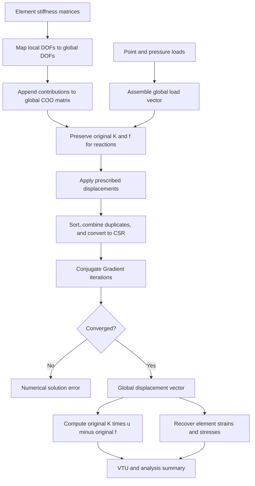

# Global System and Sparse Solution

This document describes how FinEleMethod transforms independent Q4 or H8
element equations into the solved global linear-static system. The implemented
path is:

```text
element matrices -> COO assembly -> direct elimination -> CSR ->
Conjugate Gradient -> reaction recovery
```

## Global equilibrium equation

For a linear-static model, FinEleMethod solves

\[
\mathbf{K}\mathbf{u}=\mathbf{f},
\]

where

- \(\mathbf{K}\) is the global stiffness matrix,
- \(\mathbf{u}\) is the global displacement vector, and
- \(\mathbf{f}\) is the global applied-load vector.

The degree-of-freedom map assigns every nodal displacement component a global
index. Q4 nodes contribute two indices and H8 nodes contribute three.

## Element-to-global assembly

Each element produces its own matrix \(\mathbf{K}_e\). Let
\(\mathcal{I}_e(a)\) map local element degree of freedom \(a\) to its global
degree of freedom. Assembly performs

\[
K_{\mathcal{I}_e(a),\mathcal{I}_e(b)}
\mathrel{+}=K_{e,ab}
\]

for every local row \(a\), local column \(b\), and element \(e\).

FinEleMethod initially records each contribution as a coordinate-list entry:

\[
(i,j,K_{e,ab}).
\]

COO is convenient for assembly because contributions can be appended without
first determining the final sparse row structure. Adjacent elements naturally
produce repeated \((i,j)\) coordinates at shared degrees of freedom.

The global load vector is assembled with the same degree-of-freedom map. It may
contain concentrated nodal loads and equivalent nodal loads calculated from Q4
edge pressure or H8 face pressure.

## Prescribed-displacement elimination

For a prescribed degree of freedom \(c\),

\[
u_c=\bar{u}_c.
\]

FinEleMethod applies direct elimination while the stiffness matrix is still in
COO form. For every unconstrained equation \(i\), it updates the load:

\[
f_i' = f_i-K_{ic}\bar{u}_c.
\]

Entries in constrained rows and columns are removed. The constrained equation is
then replaced with

\[
K_{cc}'=1,
\qquad
f_c'=\bar{u}_c.
\]

This preserves symmetry and produces the required displacement directly in the
solution vector. The implementation validates that each prescribed global degree
of freedom is unique, in range, and finite.

## COO-to-CSR conversion

After constraints are applied, the COO entries are sorted by row and then by
column. Entries with the same coordinate are summed:

\[
K_{ij}=\sum_{m\in\mathcal{E}_{ij}}v_m,
\]

where \(\mathcal{E}_{ij}\) is the set of COO contributions at coordinate
\((i,j)\). An assembled zero is omitted.

The resulting compressed-sparse-row matrix stores three arrays:

| Array | Meaning |
| --- | --- |
| `row_offsets` | Start and end position of each matrix row |
| `column_indices` | Column index for every retained entry |
| `values` | Numerical value of every retained entry |

For row \(i\), its entries occupy indices

\[
\text{row\_offsets}[i]
\leq k <
\text{row\_offsets}[i+1].
\]

CSR supports the repeated matrix-vector products required by the iterative
solver without storing zero entries.

## Conjugate Gradient solver

The constrained elastic stiffness system is symmetric positive definite when
the model is stable and constrained correctly. FinEleMethod therefore solves it
with the custom Conjugate Gradient method.

Starting from

\[
\mathbf{x}_0=\mathbf{0},
\qquad
\mathbf{r}_0=\mathbf{b},
\qquad
\mathbf{p}_0=\mathbf{r}_0,
\]

each iteration calculates

\[
\alpha_k=
\frac{\mathbf{r}_k^T\mathbf{r}_k}
{\mathbf{p}_k^T\mathbf{A}\mathbf{p}_k},
\]

\[
\mathbf{x}_{k+1}=\mathbf{x}_k+\alpha_k\mathbf{p}_k,
\]

\[
\mathbf{r}_{k+1}=\mathbf{r}_k-\alpha_k\mathbf{A}\mathbf{p}_k,
\]

\[
\beta_k=
\frac{\mathbf{r}_{k+1}^T\mathbf{r}_{k+1}}
{\mathbf{r}_k^T\mathbf{r}_k},
\]

\[
\mathbf{p}_{k+1}=\mathbf{r}_{k+1}+\beta_k\mathbf{p}_k.
\]

The convergence threshold is

\[
\tau=\max\left(\tau_{abs},\tau_{rel}\lVert\mathbf{b}\rVert_2\right).
\]

The solve is complete when

\[
\lVert\mathbf{r}_k\rVert_2\leq\tau.
\]

The current defaults are:

| Option | Default |
| --- | ---: |
| Relative tolerance \(\tau_{rel}\) | \(10^{-10}\) |
| Absolute tolerance \(\tau_{abs}\) | \(0\) |
| Maximum iterations | 1000 |
| Initial guess | Zero vector |

The implementation rejects invalid dimensions, non-finite inputs, invalid
tolerances, and non-positive curvature. If the iteration limit is reached
without convergence, the static solver reports a numerical-solution failure.

## Reaction-force recovery

Boundary-condition elimination changes the system used by the solver. Reactions
must therefore be recovered from the original, unconstrained equilibrium system:

\[
\mathbf{r}=\mathbf{K}_{original}\mathbf{u}
-\mathbf{f}_{original}.
\]

The original COO matrix is converted to CSR for this matrix-vector product.
Reaction components at restrained degrees of freedom represent the support
forces required to maintain the prescribed displacements. For a correctly
balanced model, applied forces and support reactions satisfy global equilibrium.

## Complete solution flow



## Implementation map

| Operation | Implementation |
| --- | --- |
| Element COO insertion | `src/assembly/coo_assembly.cpp` |
| COO storage | `src/math/coo_matrix.cpp` |
| COO-to-CSR conversion and multiplication | `src/math/csr_matrix.cpp` |
| Direct displacement elimination | `src/solver/boundary_conditions.cpp` |
| Conjugate Gradient algorithm | `src/solver/conjugate_gradient.cpp` |
| Sparse static workflow and reactions | `src/solver/sparse_static_solver.cpp` |

Focused unit tests cover every stage. End-to-end Q4 plane-stress, Q4
plane-strain, and H8 tests all use this sparse production path.
